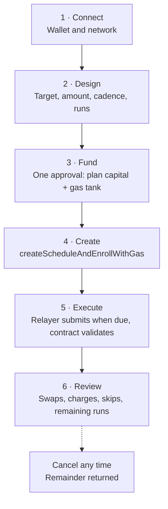
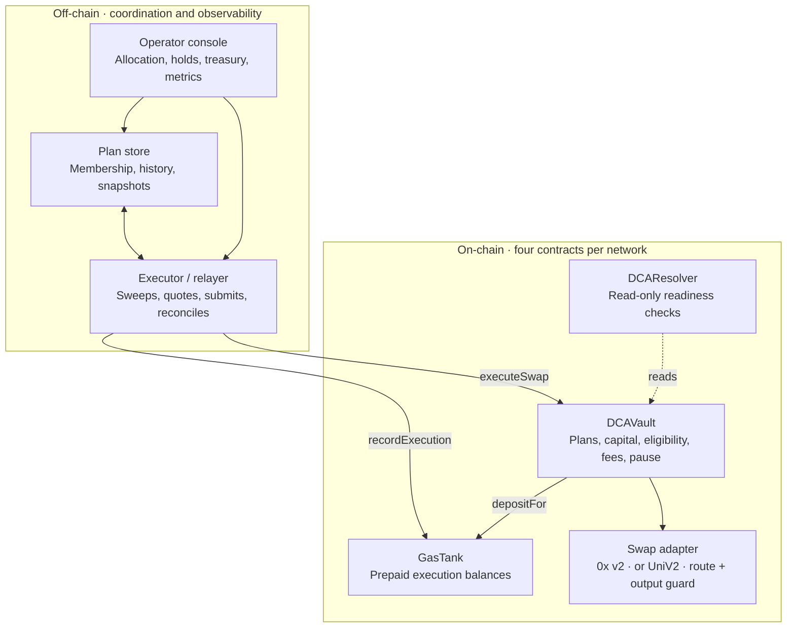
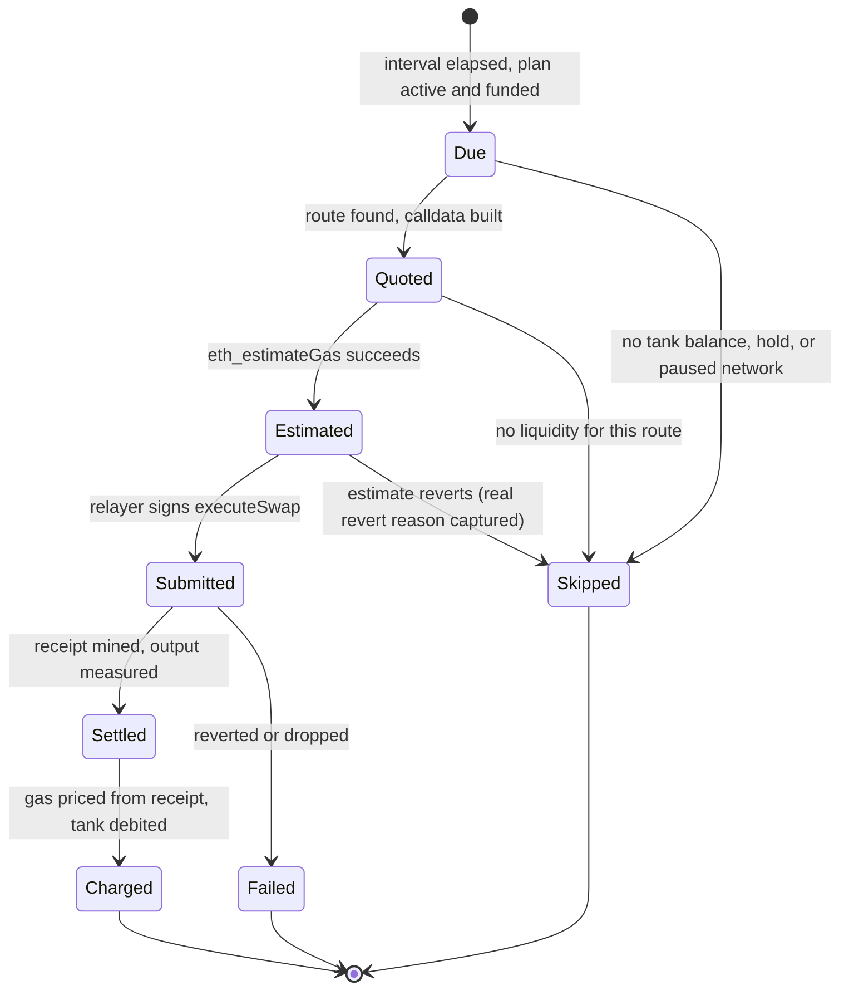
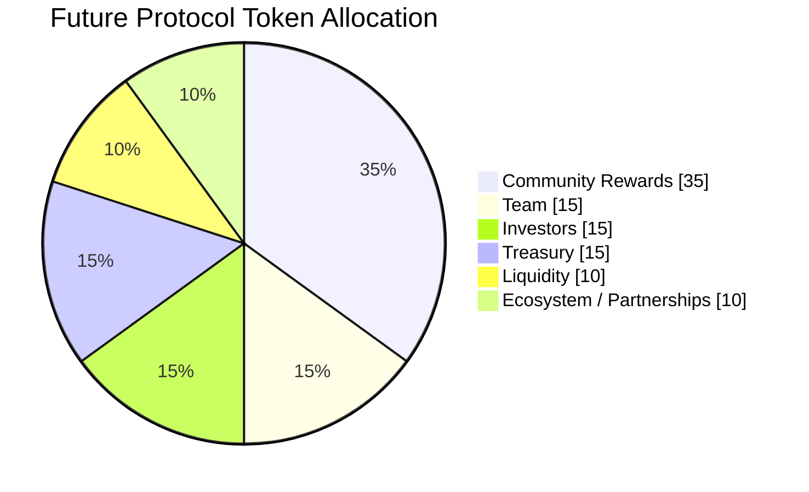
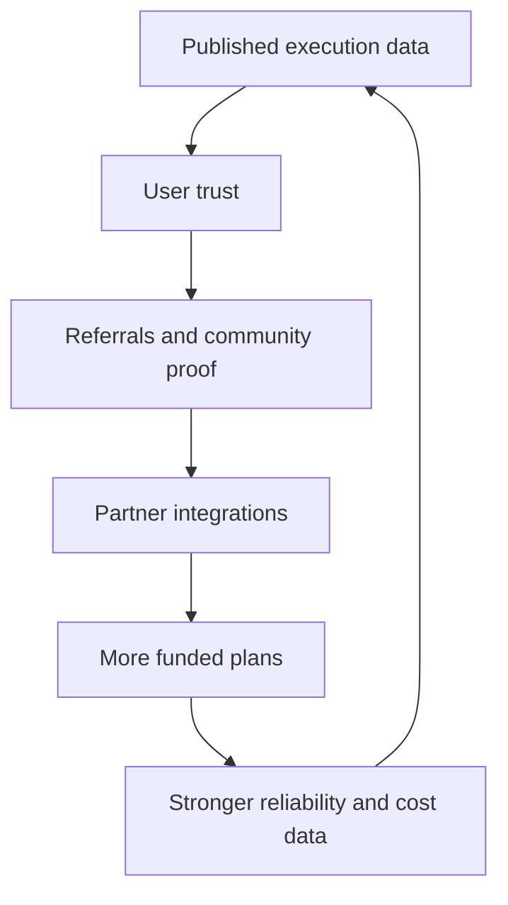

# SteadyStake

## Automated DCA. Across chains. Charged at cost.

**A non-custodial execution layer for disciplined, recurring on-chain accumulation.**

**Mainnets:** BOT Chain · BNB Chain · Polygon · Kava · Base
**Testnets:** BOT Chain Testnet · Base Sepolia · Ethereum Sepolia
**Document:** Whitepaper
**Version:** 2.0
**Date:** 30 July 2026
**Supersedes:** v1.1 (30 July 2026)

> **Document status**
>
> Every "live" claim in this version was read from the deployed contracts on the day of writing, and
> the contract addresses are listed in [§18](#18-deployed-contracts) so any reader can verify them
> independently. Planned work is labeled as planned. Nothing here is an offer of securities, a
> guarantee of returns, or financial advice.

---

## What changed since v1.1

v1.1 described a design. This version describes a running system, and three parts of that design
turned out differently in production.

| Area | v1.1 said | v2.0 says |
| --- | --- | --- |
| Execution pricing | A configured gas unit per network, illustratively $0.01, charged per settled run | **No configured price.** A run is charged the gas its two transactions actually burned, priced at the chain's own gas price and native token price, rounded up ([§8](#8-gas-tank-and-execution-economics)) |
| Gas Tank scope | One tank per network, funded per network | **Tanks are pooled** across networks of the same kind. A run on one mainnet can be paid from another mainnet's tank ([§8.4](#84-pooled-tanks-across-networks)) |
| Execution window | Target batch window: daily | **Due-driven, not batched.** The executor sweeps every ~5 seconds and settles a plan as soon as its on-chain interval has elapsed ([§7](#7-execution-lifecycle)) |
| Contract assurance | "No verified contract registry was supplied — treat as a launch gate" | **All contracts verified** on all five mainnets, with explorer links ([§18](#18-deployed-contracts)) |
| Networks | 4 live + BOT Chain integrated | **5 mainnets deployed**, in three distinct states of service ([§3.2](#32-per-network-state-of-service)) |
| Operator controls | Not described | Network allocation, per-plan holds with frozen cooldowns, and a treasury/relayer dashboard ([§10](#10-operations-and-operator-controls)) |

---

## Contents

1. [Executive Summary](#1-executive-summary)
2. [Problem](#2-problem)
3. [Networks and Market Context](#3-networks-and-market-context)
4. [Product Model](#4-product-model)
5. [User Journey](#5-user-journey)
6. [Protocol Architecture](#6-protocol-architecture)
7. [Execution Lifecycle](#7-execution-lifecycle)
8. [Gas Tank and Execution Economics](#8-gas-tank-and-execution-economics)
9. [Fees and Business Model](#9-fees-and-business-model)
10. [Operations and Operator Controls](#10-operations-and-operator-controls)
11. [Membership Tiers (planned)](#11-membership-tiers-planned)
12. [Future Protocol Token](#12-future-protocol-token)
13. [Governance](#13-governance)
14. [Security Model](#14-security-model)
15. [Roadmap](#15-roadmap)
16. [Measurement](#16-measurement)
17. [Risk and Compliance](#17-risk-and-compliance)
18. [Deployed Contracts](#18-deployed-contracts)
19. [References](#19-references)

---

# 1. Executive Summary

## A disciplined savings primitive for on-chain users

SteadyStake is a multi-chain, non-custodial dollar-cost averaging (DCA) protocol. A user defines a
recurring purchase plan, funds the plan and a prepaid execution budget, and keeps on-chain control
throughout. A relayer submits the transactions; the contracts decide whether they are permitted.

| Product fact | Current state |
| --- | ---: |
| Mainnets with contracts deployed | 5 |
| Mainnets with automation wired end to end | 4 |
| Contracts per network | 4 |
| Free auto-executed plans | 1 per wallet, per network |
| Protocol swap fee | 0.25% (25 bps, on-chain) |
| Execution charge | Metered — gas burned, at cost |
| Executor sweep interval | ~5 seconds |
| Contracts verified on public explorers | All, all five mainnets |
| Independent security audit | Not yet — see [§14](#14-security-model) |

### The product promise

Set a plan once. Keep the assets in your own wallet's control path. Execute consistently without
handing custody to an exchange, and pay for automation at what it actually costs.

### The operating model

Plan capital and execution funding are separate pools. Plan capital sits in the vault and can only
leave it as a swap to the plan owner or a refund to the plan owner. Execution funding sits in a Gas
Tank and is debited only by the relayer, only for gas it has already spent.

### Current status

| Status | Description |
| --- | --- |
| **Live** | BOT Chain, BNB Chain and Polygon: full stack deployed, verified, and auto-executing. |
| **Live, settlement only** | Kava: contracts deployed and verified; no viable DEX route on that chain yet, so swaps are not enabled ([§3.2](#32-per-network-state-of-service)). |
| **Live, manual only** | Base: an earlier generation of the vault, deployed before the Gas Tank existed. Plans work; auto-execution needs the newer stack ([§3.2](#32-per-network-state-of-service)). |
| **In delivery** | Beta hardening toward public launch: paid additional auto plans, exports, alerting. |
| **Planned** | Membership tiers, guided strategy assistants, and a protocol token that can unlock product benefits. |

### North star

Become the default recurring deployment layer for crypto savings across chains — and the one whose
costs a user can check.

---

# 2. Problem

## Consistency is easy to understand and hard to execute

Long-term crypto users usually know the behavior they want: buy a chosen asset at regular intervals
and stop timing the market. The friction is in the repetition.

| Challenge | User impact |
| --- | --- |
| Manual behavior | Missed purchases, emotional decisions, and a signature prompt every single time. |
| Custodial automation | Exchanges automate recurring buys well, but only if you give them your assets. |
| Fragmented DeFi | Approvals, routing, funding, and execution are re-learned on every network. |
| Unfunded execution | A due plan still needs someone to submit a transaction and hold the native token to pay for it. |
| Opaque costs | A flat "automation fee" tells you nothing about whether it is a markup or a cost. |
| Scale pressure | As plan count grows, scanning, submission, retries, and reconciliation have to stay dependable. |

### Design response

Four commitments, each of which shows up somewhere concrete in this document:

1. **Separate strategy capital from execution funding** — different contracts, different rules
   ([§6](#6-protocol-architecture)).
2. **Put the rules on-chain and the coordination off-chain** — the relayer chooses *when*, the
   contract decides *whether* ([§7](#7-execution-lifecycle)).
3. **Charge automation at cost, and publish the range** — no rate card, a receipt
   ([§8](#8-gas-tank-and-execution-economics)).
4. **Make the whole thing inspectable** — verified source, public addresses, per-network metrics
   ([§16](#16-measurement), [§18](#18-deployed-contracts)).

---

# 3. Networks and Market Context

## 3.1 A multi-chain stablecoin base is ready for recurring deployment

Stablecoins are the practical funding rail for on-chain DCA. The four EVM networks with public
stablecoin snapshots held roughly **$21.45 billion** on 29 July 2026 per DefiLlama. BOT Chain is
excluded from this total because no equivalent snapshot exists for it. These values move
continuously and are context, not forecasts.

| Network | Stablecoin value | Settlement token used by SteadyStake |
| --- | ---: | --- |
| BNB Chain | $13.385B | Binance-Peg USDC (**18 decimals**) |
| Base | $4.842B | Circle USDC (6 dec) |
| Polygon | $3.142B | Circle native USDC (6 dec) |
| Kava | $0.077B | Native Tether USDt (6 dec) |
| BOT Chain | *no snapshot* | Bridged USDT (6 dec) |
| **Snapshot total** | **~$21.45B** | |

Two settlement choices in that table are deliberate and worth stating, because each one was a bug
before it was a decision:

- **BNB Chain settles in an 18-decimal stablecoin.** Every liquid BSC stablecoin is 18-decimal; the
  6-decimal bridged wrappers hold only a few hundred thousand dollars in total. So chain 56 is the
  one network where "one dollar" is 10¹⁸ base units, and every amount the protocol moves is scaled
  per chain rather than by a global constant.
- **Kava settles in USDt, not USDC.** Kava's USDC came from the Multichain bridge, which shut down
  in 2023 and left that token stranded. Native Tether USDt is the live one.

## 3.2 Per-network state of service

Not every deployment is in the same state, and rounding them all up to "live" would be the easiest
way to mislead a reader. Each row below reflects the contracts as read on 30 July 2026.

| Network | Chain ID | Vault + Resolver | Gas Tank | Swap route | Auto-execution |
| --- | ---: | :---: | :---: | --- | --- |
| BOT Chain | 677 | ✅ | ✅ | BDEX V2 via `UniV2SwapAdapter` | ✅ Live |
| BNB Chain | 56 | ✅ | ✅ | 0x Swap API v2 | ✅ Live |
| Polygon | 137 | ✅ | ✅ | 0x Swap API v2 | ✅ Live |
| Kava | 2222 | ✅ | ✅ | ⚠️ None enabled | ⚠️ Blocked by routing |
| Base | 8453 | ✅ | ❌ | 0x adapter deployed | ⚠️ Manual only |
| BOT Chain Testnet | 968 | ✅ | ✅ | BDEX V2 | ✅ Live (test) |
| Base Sepolia | 84532 | ✅ | ✅ | Mock router | ✅ Live (test) |
| Ethereum Sepolia | 11155111 | ✅ | ✅ | Mock router | ✅ Live (test) |

**Kava — why swaps are off, on purpose.** 0x does not support chain 2222 at all, and Equilibre, the
only DEX of size, is a Solidly fork whose router interface the standard Uniswap-V2 adapter cannot
even be constructed against. The USDt/WKAVA pool is worth a few hundred dollars. The contracts were
therefore deployed with a swap router that has no code behind it: a swap attempt fails the vault's
own "no output received" guard rather than moving funds, and the relayer skips the plan before
spending gas on it. Enabling Kava means writing a Solidly adapter and calling `setSwapRouter` — no
vault redeployment, no user migration.

**Base — why automation is not on yet.** Base carries the first generation of the vault, deployed
before the Gas Tank existed; calling `gasTank()` on it reverts. The executor skips any network
without a Gas Tank, so Base plans are user-triggered today. Bringing Base to parity is a fresh
deployment of the current four contracts plus an address sync, not a protocol change.

**BOT Chain — liquidity caveat.** BOT Chain is the partner network and leads every network list in
the product, but BDEX V2's USDT/WBOT pool is still shallow. Plan sizes there should stay small until
pools deepen. This is a market condition, not a contract limitation.

## 3.3 Adding a network

A network exists to the protocol only if it appears in a static registry that carries its name,
explorer, default RPC, native symbol, and mainnet/testnet classification — and separately, if it has
contracts in the deployment record. An operator can allocate, pause, or remove any registered
network at runtime, but cannot conjure one: "add a network" must never be able to point the relayer
at a chain whose vault, RPC, and stablecoin nobody has verified.

---

# 4. Product Model

## The DCA plan is the product's core object

One plan connects intent, funded capital, execution eligibility, swap settlement, and history.

| # | Plan field | Where it lives | Notes |
| ---: | --- | --- | --- |
| 1 | Network | On-chain (per-chain vault) | Each network has its own vault and its own plans. |
| 2 | Settlement token | On-chain (`usdc`) | Fixed per network at deployment ([§3.1](#31-a-multi-chain-stablecoin-base-is-ready-for-recurring-deployment)). |
| 3 | Target token | On-chain (`targetToken`) | From a curated list per network, plus trending additions. |
| 4 | Amount per interval | On-chain | In the settlement token's base units. |
| 5 | Frequency | On-chain (enum) | 1-minute (test), daily, weekly, bi-weekly, monthly. |
| 6 | Total committed | On-chain (`totalAmount`) | Capped at 10,000,000 whole settlement tokens per plan. |
| 7 | Executed count | On-chain | Increments per settled run. |
| 8 | Auto-execution enrollment | On-chain (`enrolledForAutoExecution`) | First plan per wallet per network is free. |
| 9 | Next eligible time | Derived on-chain | `lastExecutionTime + interval`, readable by any client. |
| 10 | Gas Tank balance | On-chain (per network, pooled in use) | Separate from plan capital ([§8](#8-gas-tank-and-execution-economics)). |
| 11 | Status | On-chain + operator layer | Active, completed, cancelled; plus operator holds ([§10](#10-operations-and-operator-controls)). |
| 12 | History | Events + indexed store | Transaction, amount delivered, charge, failure reason. |

### Cadence does not drift

A run does not reset the clock to "now". The contract advances `lastExecutionTime` by whole
intervals only, so a relayer confirming forty seconds late does not push every future run forty
seconds later. A weekly plan stays on its weekday for its whole life.

### User control

A plan owner can always, subject to contract rules:

- Cancel the plan and withdraw the unspent remainder.
- Execute an eligible plan themselves, from their own wallet, paying their own gas.
- Top up or withdraw Gas Tank balance.
- Review every settlement, charge, and skip.

**Early cancellation.** Cancelling while **more than 50%** of the original commitment is still
unspent charges a 3% fee on the remainder. At or below 50%, cancellation is free. Both numbers are
constants in the vault, visible on-chain, and cannot be changed by an operator.

**What a plan owner cannot do today:** pause a plan without cancelling it, or change a plan's
parameters after creation. Both are cancel-and-recreate operations. Pause/resume for owners is on
the roadmap ([§15](#15-roadmap)).

---

# 5. User Journey

## A visible path from intent to settlement



### One approval, not four

Creating a first auto plan is a single vault call that pulls plan capital *and* the Gas Tank deposit
in one transfer, creates the schedule, enrolls it for auto-execution, and forwards the gas portion
into the Gas Tank on the user's behalf. The user approves once and signs once.

| Mode | Behavior |
| --- | --- |
| **Auto mode** | The relayer submits due runs. One enrolled plan per wallet per network is free; additional concurrent auto plans are a paid unlock ([§9](#9-fees-and-business-model)). Requires a funded Gas Tank. |
| **Manual mode** | Anyone may call `executeSwap` for a due plan — including its owner — paying their own network gas. No Gas Tank needed, no enrollment needed. This is the fallback whenever automation is unavailable, and the reason a paused network never traps funds. |

---

# 6. Protocol Architecture

## On-chain truth, off-chain coordination



### On-chain components

| Contract | Responsibility | Key properties |
| --- | --- | --- |
| **DCAVault** | Plan creation, capital custody, interval enforcement, swap dispatch, fee accrual, cancellation | `Ownable`, `Pausable`, `ReentrancyGuard`; per-plan deposit cap scaled to the settlement token's decimals |
| **GasTank** | Per-user prepaid execution balances; reimburses the relayer | Only a single configured `executor` may debit; deposits and withdrawals are open to the balance owner |
| **Swap adapter** | Builds and executes the swap; measures what was actually delivered | Two implementations: 0x Swap API v2 (AllowanceHolder) and a Uniswap-V2-compatible router adapter |
| **DCAResolver** | View-only "is this plan ready" and batch variants | No state, no funds, no privileges |

### Off-chain services

| Service | Responsibility |
| --- | --- |
| **Executor** | Sweeps every network in service, reads ready plans, fetches live swap calldata, estimates gas, submits, prices the run from its receipt, and debits the tank. |
| **Plan store** | Records plans, executions, cancellations, gas-tank and portfolio snapshots. Also the membership list the relayer works from ([§6.1](#61-the-off-chain-state-boundary)). |
| **Operator console** | Network allocation, per-plan holds, relayer/treasury balances, gas and cost profiles, execution history. |

> **System boundary**
>
> The contracts define what may happen; the relayer only decides when to try. The off-chain services
> cannot change plan ownership, redirect a swap's output, bypass an interval, or withdraw plan
> capital — those are not permissions it holds. What it *can* do is debit a Gas Tank, and that
> boundary is stated plainly in [§14.2](#142-the-relayer-trust-boundary).

## 6.1 The off-chain state boundary

One property of the current design deserves to be explicit, because it explains a whole class of
behavior:

**No contract in the system can enumerate its users.** The vault exposes per-user views only —
schedule count, schedule detail, ready IDs, enrolled IDs. There is no members array. So the answer
to "which wallets have plans on network X" comes from the database, or from a log scan.

Consequences, honestly stated:

- A plan whose creation was never recorded off-chain is invisible to the dashboard **and** is never
  auto-executed, even though it exists on-chain and the user enrolled it.
- Recovery paths exist and are used: a per-chain probe that re-checks every wallet the store has
  ever seen (rate-capped, with negative results cached), and an explicit log-scan reindex.
- The plan owner is never locked out by this. Manual execution reads the chain directly.

Making membership discoverable on-chain — a members array or an indexed creation event the executor
can trust as the sole source — is a contract change queued behind the next vault deployment.

---

# 7. Execution Lifecycle

## Every run follows an explicit state machine



### Cadence and timing

The executor sweeps roughly every **5 seconds**. Plan cadence is not the sweep — it is the
on-chain interval. So a due plan is normally settled within seconds of becoming due, and a plan
that is not due costs nothing but a read. There is no daily batch window.

### Failure branches

| Condition | Response | State impact |
| --- | --- | --- |
| Not yet due | Skipped silently, no charge. | Active. |
| Plan capital exhausted | Vault deactivates the plan and un-enrolls it automatically on the final run. | Completed. |
| Insufficient Gas Tank (all eligible tanks) | Skipped, user notified, no gas spent. | Active, blocked until funded. |
| No liquidity / no executable quote | Skipped before submission. | Active; retried next sweep. |
| Gas estimate reverts | Skipped, and the **real** revert reason is captured — once mined, the vault's low-level call flattens it into a generic failure. | Active; reason recorded. |
| Operator hold on the plan | Skipped; the plan's remaining cooldown is frozen ([§10.2](#102-per-plan-holds-and-frozen-cooldowns)). | Held. |
| Network paused or removed | Whole network skipped; existing plans stay visible and cancellable. | Held at network level. |
| Contract paused | Every protected entry point reverts. | Paused globally. |

### Double-settlement safety

Idempotency is not a convention in the off-chain service — it is enforced by the contract. A second
`executeSwap` inside the same interval reverts on `"Not enough time passed"`, whatever sent it: a
retry, a duplicate sweep, two relayers, or an unrelated caller. The off-chain layer's job is
therefore only to avoid *paying* for a transaction that will revert, which is what the pre-flight
gas estimate is for.

### What a run costs to observe

Neither the vault's event nor its return value carries the swap's output amount — the event emits a
literal zero in that field. The amount delivered is therefore read from the receipt's own ERC-20
transfer logs at the moment the receipt is in hand, summing multi-hop and fee-on-transfer legs. This
is the only chance to capture it cheaply; reconstructing it later would mean re-fetching every
historical receipt.

---

# 8. Gas Tank and Execution Economics

## 8.1 The model: metered, not priced

**Nobody sets what a run costs.** A run is two transactions — `executeSwap` on the vault and
`recordExecution` on the Gas Tank — and the user is charged the gas those two burned, at the chain's
gas price, converted at the native token's USD price, in the settlement stablecoin.

```text
charge  =  gas_burned  ×  gas_price  ×  native_token_usd     (rounded up)
```

Rounding is always **up**, and always toward the party that fronted the gas. Every fraction of a
base unit lost to truncation would otherwise be gas the relayer paid on a user's behalf and never
recovers.

The vault's `gasCostPerExecutionUsdc6` field still exists and is still settable by its owner, but
**nothing reads it**. The environment variable that used to override it is gone. A fixed rate could
only ever be wrong in one of two directions — overcharging the user or leaving the relayer short —
and both were observed before it was removed.

## 8.2 The one leg that must be predicted

The swap's cost is read from its receipt: exact, no estimate involved. The deduction cannot be —
`recordExecution` takes the amount to debit as an argument, so the amount must be chosen before the
transaction that debits exists.

That leg is priced from the chain's **measured median** record-leg gas, widened by 20%. The medians
come from the runs themselves: every completed run's two receipts are recorded per chain and per
leg, and the median is served to the relayer and published through the API. Until a chain has
measured runs of its own it uses a seed — 260,000 gas for the direct-router path, 320,000 for the
aggregator path — and each figure is labeled with whether it is **simulated**, **measured**, or a
**seed**, so a dashboard never presents an assumption as a measurement.

Measured on BOT Chain mainnet, from relayer receipts:

| Leg | Observed gas (min / median / max) |
| --- | ---: |
| `executeSwap` | 187,631 / 205,666 / 238,931 |
| `recordExecution` | 43,375 / 51,418 / 51,418 |
| **Per run** | **239,049 / 249,041 / 290,349** |

A run on an aggregator chain costs more, which is why the seeds differ and why the medians are kept
per chain rather than globally.

## 8.3 Gas limits are estimated, not fixed

How much gas a run needs is a property of the route the aggregator picked this minute, not of the
chain. A direct mock-router swap costs ~120k; a two-hop 0x route on BNB Chain costs ~540k. Each
`executeSwap` is therefore sent with a limit derived from `eth_estimateGas` plus 30% headroom,
floored at 400,000 and capped at 3,000,000 — the floor so a cheap estimate cannot starve a route
that moved between the estimate and the block, the cap so an absurd estimate from a misbehaving node
cannot hand the relayer's whole native balance to one transaction.

This replaced a fixed 400,000 limit, which is what silently broke BNB Chain: a PancakeSwap Infinity
route needs ~540k, and the adapter's low-level call ran out of its 63/64 share of remaining gas and
returned false. The vault reported "swap failed", which reads like a liquidity fault and hid the
real cause for days.

## 8.4 Pooled tanks across networks

Gas Tanks are per network, but they are **spent as a pool**. A run on one network can be paid out of
another network's tank: the executing chain's tank is preferred, and if it cannot cover the cost the
richest eligible tank that can is used instead.

Two rules bound the pool, both learned the hard way:

1. **Same network type only.** A mainnet run can only be paid from a mainnet tank. Before this rule,
   testnet tanks holding faucet-minted mock stablecoin were the "richest" tank a user had, so real
   mainnet runs were reimbursed in play money while the user's real tank sat untouched.
2. **Everything is normalised before comparison.** Balances live in each chain's own base units, and
   BNB Chain's are 10¹² larger than everywhere else. All cross-chain sums and comparisons happen at
   a canonical 6-decimal scale; a charge is restated into the debited chain's units, rounded up, at
   the moment of debit.

A cross-chain settlement costs more than a same-chain one — two chains, two gas prices — so those
runs are flagged as such, kept out of each chain's gas medians, and reported separately in the cost
statistics. Users see the same-chain and cross-chain averages side by side.

## 8.5 What the user is shown

Because the charge varies, the product publishes its range rather than a rate:

| Shown | Why |
| --- | --- |
| Average charge over recent runs on this network | The number to plan with. |
| **Maximum** charge over those runs | Someone deciding how much to top up needs the worse end, not the typical one. |
| Same-chain vs cross-chain average | Cross-chain runs cost more; that is drawn as two bars on one scale, not explained in a paragraph. |
| Estimated runs remaining at the current average | Turns a balance into the only unit that matters: runs. |
| Source label (measured over N runs / estimated / seed) | "Measured over 340 runs" and "estimated" are not the same claim. |

Native token prices come from a batched multi-source feed — the BOT Chain DEX pool for BOT, then
CoinGecko, Coinbase, and Binance in turn — with bounded timeouts and a last-known-good fallback that
is served flagged as stale. A slightly old quote prices a run far better than no quote at all.

## 8.6 Funding a plan

For a plan of `N` runs at `X` per run, on a network whose recent average run charge is `C`:

```text
Plan capital  =  X × N
Gas Tank      ≈  C × N        (C is measured, and published with its maximum)
```

Illustratively, at a 250,000-gas run on a chain where that comes to a fraction of a cent, a
200-run plan at $10 commits $2,000 of capital and a Gas Tank measured in single-digit dollars or
less. The actual figure is quoted live in the product, per network, at creation time — there is no
rate card here to go stale.

### User protections

- Low-balance warnings and a visible remaining-runs estimate.
- Withdrawable Gas Tank balance at any time; unused funds are never forfeited.
- Charges are only ever taken for a **settled** run. A skip costs nothing.
- Plan capital and gas funding are separate balances in separate contracts.

---

# 9. Fees and Business Model

## 9.1 What is charged today

| Charge | Rate | Where enforced | Live? |
| --- | --- | --- | ---: |
| Protocol swap fee | **0.25%** of each run's amount (25 bps; contract maximum 5%) | `DCAVault.feePercentage`, taken before the swap | ✅ Live on all five mainnets |
| Early cancellation | **3%** of the remainder, only if >50% of the commitment is unspent | `DCAVault`, hard-coded constants | ✅ Live |
| Execution gas | At cost, metered per run ([§8](#8-gas-tank-and-execution-economics)) | `GasTank.recordExecution` | ✅ Live |
| Additional auto plans | Flat fee per extra concurrent auto plan | `DCAVault.additionalAutoPlanFeeUsdc6` | ⏳ **Not yet enabled** — the fee is 0 and no recipient is set on any mainnet, so extra auto plans currently cannot be purchased at all |
| Automation margin | Spread over metered cost | Would be in the charge itself | ⏳ Not applied — runs are charged at cost today |

Verified on-chain on 30 July 2026: `feePercentage = 25` and `additionalAutoPlanFeeUsdc6 = 0` with
`autoPlanFeeRecipient = 0x0` on chains 56, 137, 677, and 2222.

So the honest revenue statement is: **today the protocol earns the 0.25% swap fee and the early-exit
fee, and breaks even on execution.** The first thing that changes at public launch is switching on
the additional-auto-plan fee.

## 9.2 Where revenue accrues

The operator wallet does two jobs at once, and conflating them is how a relayer runs dry while the
books look healthy:

- **It pays**, in each chain's **native** token, for both transactions of every run. That balance is
  what stops automation when it hits zero, and it is per chain — a funded relayer on Polygon does
  nothing for a dry one on BNB Chain.
- **It earns**, in each chain's **stablecoin**, because `recordExecution` sends the user's charge to
  the caller.

Different tokens, so the wallet can be accruing charges steadily and still be minutes from being
unable to execute. The operator console reads both legs per network side by side for exactly this
reason, along with the vault's accrued swap fees (earned but not yet withdrawn) and the configured
auto-plan fee recipient — read rather than assumed, because a misconfigured recipient sends revenue
to an address nobody is watching.

## 9.3 Planned revenue streams

| Stream | Model | Status |
| --- | --- | --- |
| Additional auto plans | Flat on-chain fee per extra concurrent auto plan, per network | Contract support shipped; pricing not yet set |
| Membership tiers | Subscription and/or stake-qualified tiers with fee, capacity, and feature benefits | Designed ([§11](#11-membership-tiers-planned)) |
| Automation margin | A disclosed component within published execution pricing, itemized separately from network cost | Not applied |
| AI assistance | Optional premium planning, monitoring, and education. Never a performance guarantee | Planned |
| Partner distribution | Wallet, chain, community, and application integrations with disclosed terms | Planned |
| Token benefits | Product access and loyalty benefits, subject to final legal and governance design | Planned ([§12](#12-future-protocol-token)) |

> **Sustainable rule**
>
> Revenue must come from an understandable service — not from custody of user assets, hidden
> routing, or promised investment returns. Where a charge is a pass-through cost, it is disclosed as
> a cost; where it is a margin, it is disclosed as a margin.

---

# 10. Operations and Operator Controls

Reliability is mostly an operations story, so the controls are part of the design rather than an
afterthought. Every one of them is off-chain and advisory, and none can move user funds.

## 10.1 Network allocation

Each registered network is in one of three states, editable at runtime:

| State | Users see it | New plans | Relayer executes | Existing plans |
| --- | :---: | :---: | :---: | --- |
| **Enabled** | ✅ | ✅ | ✅ | Normal |
| **Paused** | ✅ | ❌ | ❌ | Stay visible: cancel, withdraw, reclaim gas funds |
| **Removed** | ❌ | ❌ | ❌ | Untouched on-chain; manual execution still possible |

A network with no explicit allocation is **enabled** with the registry's own classification. That
default direction is deliberate: a newly deployed chain is live rather than invisible until someone
remembers to allocate it, and a database that has never been written to behaves identically to one
that has.

A paused network never hides plans that hold user money. That is a rule, not a preference.

## 10.2 Per-plan holds and frozen cooldowns

An operator can stop the relayer from auto-executing one plan without touching the chain. The plan,
its enrollment, and its deposit are untouched; only the backend's willingness to execute changes.
Holds are either reversible (`paused`) or final (`cancelled` — automation stopped for good, with the
user still able to cancel on-chain and recover their remainder).

A hold **freezes the plan's remaining cooldown**. The chain does not know a plan is held —
`lastExecutionTime` is fixed, so its interval keeps elapsing — which is why lifting a hold used to
fire the plan instantly no matter how long it had left. Now the remainder is captured when the hold
is placed and repaid as a resume gate: lift a hold with four days left, and the plan is treated as
not-yet-due for four more days. The owner can still execute it themselves whenever the contract
permits.

## 10.3 What an operator can and cannot do

| Can | Cannot |
| --- | --- |
| Pause, resume, or remove a network | Move, redirect, or withhold plan capital |
| Hold or release automation on one plan | Change a plan's owner, target, amount, or cadence |
| Pause the vault entirely (emergency) | Prevent a plan owner from cancelling and withdrawing |
| Set the swap fee (contract max 5%) and the auto-plan fee | Charge a settled run more than its gas cost as computed above |
| Set the swap router / adapter address | Take custody of a swap's output — it is sent to the plan owner by the contract |
| Withdraw accrued protocol fees | Withdraw a user's Gas Tank balance to anywhere but reimbursement |

The right-hand column is enforced by the contracts. The left-hand column is what a compromised
operator key could do, and it is priced into [§14](#14-security-model) accordingly.

---

# 11. Membership Tiers (planned)

Designed, not shipped. Four tiers, with the free tier as the acquisition funnel and two paths to
qualify — recurring subscription or a stake lock — so no recurring billing rail is mandatory.

| Tier | Indicative price | Active plans | Swap fee | Early cancel | Target user |
| --- | --- | ---: | ---: | ---: | --- |
| Starter | $0 | 1 | 0.25% | 3% | Trying the product |
| Plus | $9 / mo | 5 | 0.20% | 2% | Regular retail DCA |
| Pro | $29 / mo | 25 | 0.15% | 1% | Multi-chain, active |
| Institutional | from $199 / mo | Unlimited | 0.10% or custom | 0% | Funds, treasuries, whitelabel |

Tier benefits span capacity (plans, capital caps, wallets, history retention), execution (cadences,
queue priority, retries, gas credits), fees, asset and network breadth, strategy features
(conditional buys, take-profit, value averaging, templates, backtests), reporting (exports, tax
reports, alerts, webhooks, API), and support.

### The enforcement rule

**Anything that changes a token transfer amount is enforced on-chain; everything else stays in the
backend.** Fee basis points and early-cancel rates therefore need a per-user override in the vault —
a UI-level tier is not a fee tier. Plan counts and capital caps are enforced at creation. Cadence,
queue priority, retries, gas sponsorship, alerts, exports, API limits, and seats are off-chain
resource allocation and belong in the backend.

### Open design questions

1. Subscription, staking, or both as the qualification path?
2. Is a membership an NFT (transferable, composable) or a plain record?
3. Global membership or per-chain? Global is simpler; per-chain fits the multi-chain vault.
4. Does the on-chain fee override read a subscription contract directly, or take a signed
   attestation from the backend?
5. Grandfathering for existing users.

Downgrade behavior is already decided on one point: an over-limit user's live plans **keep running
to completion**, and only new plan creation is blocked. Killing a live plan would be a fund-movement
event, and operator-triggered fund movement is exactly what this architecture exists to avoid.

---

# 12. Future Protocol Token

## A community-weighted allocation with controlled release

The tokenomics model allocates 100% of a future protocol token across six categories. Name, symbol,
total supply, launch date, legal characterization, and final vesting contracts are **not yet
specified**.



| Pool | Share | Indicative release control |
| --- | ---: | --- |
| Community Rewards | 35% | Programmatic emissions against published reward rules and budgets |
| Team | 15% | Cliff plus multi-year linear vesting, no discretionary early unlock |
| Investors | 15% | Contractual lock-up and linear vesting, disclosed before any sale |
| Treasury | 15% | Multisig first, then progressive governance with public proposals and reporting |
| Liquidity | 10% | Launch and market-support budget with transparent wallet labeling |
| Ecosystem / Partnerships | 10% | Milestone-based grants with measurable deliverables |
| **Total** | **100%** | |

## Token utility

| Proposed utility | Description |
| --- | --- |
| Auto-execution tickets | Redeemable access to additional automated plans, or funded service credits |
| Execution discounts | Published tier benefits that reduce protocol charges. Network gas cost stays real and stays disclosed |
| Premium assistants | Advanced templates, monitoring, and planning tools |
| Loyalty rewards | Time-bound programs for measurable participation, not guaranteed appreciation |
| Governance | Progressive voting over bounded configuration, treasury programs, and integrations |
| Ecosystem alignment | Incentives for partners, beta contributors, and growth programs, with controls |

### Guardrails

- Core non-custodial plan access must never require the token.
- Benefits must be measurable, published, and change-controlled.
- No guaranteed-return, fixed-appreciation, or hidden-buy-pressure claims.
- A discount can reduce a **protocol** charge; it cannot reduce network gas, and must never be
  presented as if it could.
- Final design requires legal review in each launch jurisdiction.

---

# 13. Governance

## Control decentralizes in stages as the system matures

| Stage | Model | Scope |
| ---: | --- | --- |
| 1 | Operational multisig | Security-sensitive roles held by a documented multisig; parameter changes logged; emergency response available |
| 2 | Public proposals | Community discussion and temperature checks on fees, integrations, grants, and non-critical parameters |
| 3 | Bounded on-chain voting | Approved scopes execute through a timelock; a security council retains narrowly defined emergency powers |
| 4 | Mature protocol | Broader treasury and upgrade authority, after audits, monitoring, contributor diversity, and operating history |

**Current stage: 1, with a known gap.** Contract ownership and the relayer role are held by a single
operator key today, not a multisig. Moving ownership to a multisig is the first governance
deliverable and is listed as a launch gate in [§14](#14-security-model), not as an accomplishment.

### Governance principles

| Principle | Application |
| --- | --- |
| Least privilege | Every role gets only the permissions its function requires |
| Separation of duties | Treasury, execution, upgrades, and emergency controls belong to distinct roles — today they are not, and that is the gap above |
| Time to inspect | Material upgrades and parameter changes get public notice and timelocks where safe |
| Exit rights | Users always retain a path to cancel and withdraw, including while a network is paused |
| Visible accountability | Proposals, signers, deployments, and treasury movements are documented |

---

# 14. Security Model

## 14.1 What is in place

Non-custody removes one class of risk. It does not remove smart-contract, routing, infrastructure,
governance, or market risk.

| Area | Implemented |
| --- | --- |
| Contract controls | OpenZeppelin `Ownable`, `Pausable`, `ReentrancyGuard` on the vault; executor-gated debits on the Gas Tank; input validation; a per-plan deposit cap scaled to the settlement token's decimals; a deploy that reverts rather than guessing those decimals |
| Swap safety | Output measured as a **balance delta**, not decoded from a return value; a swap that delivers nothing reverts on an explicit guard; slippage bounded per quote (default 100 bps); the swap's output is sent by the contract to the plan owner and cannot be redirected |
| Execution safety | Pre-flight gas estimation so a doomed run is skipped rather than paid for; estimated limits with a floor and a hard cap; nonce management per chain; bounded RPC timeouts; interval enforcement in the contract, which makes double settlement impossible rather than merely unlikely |
| Cost integrity | Every charge derived from a receipt and rounded up in the payer's favor; cross-chain charges restated into the debited chain's units; charges never applied to a skipped run |
| Verification | All four contracts verified on public explorers, on every mainnet ([§18](#18-deployed-contracts)) |
| Operational | Per-plan holds with frozen cooldowns, network-level pause that never hides funded plans, per-network relayer balance and cost monitoring, run and failure history with reasons |

## 14.2 The relayer trust boundary

Stated plainly, because it is the part a reader should not have to infer.

**What the relayer cannot do.** It cannot create, modify, retarget, or cancel a plan. It cannot
withdraw plan capital. It cannot receive a swap's output. It cannot execute a plan before its
interval elapses. `executeSwap` is permissionless — the relayer holds no privilege there that a plan
owner does not also hold.

**What the relayer can do.** It is the Gas Tank's `executor`, and `recordExecution` debits the
amount the executor passes it, up to the user's balance, and transfers it to the caller. The
contract does not itself verify that the amount corresponds to gas actually burned. So a compromised
relayer key could drain Gas Tank balances — bounded by those balances, and *only* those balances.
Plan capital is out of reach.

Three things follow, and they are the design's honest response:

1. Gas Tanks should be funded for a plan's expected runs, not stuffed. The product's remaining-runs
   estimate exists partly for this reason.
2. Charge correctness is currently an **operational** guarantee backed by published per-run receipts
   and reconcilable metrics, not a contract-enforced one.
3. Moving that check on-chain — a per-run charge ceiling, or a charge derived from verifiable
   on-chain data — is the highest-value contract improvement available and is queued for the next
   vault generation.

## 14.3 Launch gates — not yet met

> **Evidence boundary**
>
> The following are **outstanding**, and none of them should be read as implied by anything above:
>
> - **No independent smart-contract audit.** Not commissioned, not in progress, not complete.
> - **No bug bounty program.**
> - **Contract ownership and the relayer role sit on a single operator key**, not a multisig. The
>   deployer and the relayer are the same wallet.
> - **Single executor.** No redundant relayer, so relayer downtime is automation downtime. Manual
>   execution remains available to every plan owner throughout.
> - **No published service-level history.** Metrics are instrumented ([§16](#16-measurement)); the
>   public scorecard has not been published yet.
> - **No timelock** on owner-only functions.
>
> Verified source code and a public address registry are real and shipped. Everything in this list
> is a gate, and each one is a roadmap item rather than a footnote.

---

# 15. Roadmap

## Reliability first, distribution second

| Phase | Timing | Status | Priorities |
| --- | --- | --- | --- |
| **1 · Mainnet and reliability** | Done | ✅ Shipped | Contracts live and verified on mainnet; relayer executing; gas charged at cost from receipts; operator holds, gates, and network allocation |
| **2 · Public launch** | 0–3 months | 🔵 In progress | Beta cohort (~50 testers); paid additional auto plans; Base brought to Gas Tank parity; multisig ownership; deeper execution history and exports; uptime and failure alerting; published reliability scorecard |
| **3 · Expansion** | 3–8 months | Next | More high-demand chains; a Solidly adapter to enable Kava swaps; membership tiers with execution discounts; wallet and DeFi integrations; plan templates; owner-side pause/resume |
| **4 · AI and token** | 8–12 months | Planned | AI strategy assistants; token-linked auto-plan tickets and discounts; multi-executor redundancy; on-chain charge ceiling |

### Beta acceptance criteria

Gates on leaving beta, not aspirations:

- No unauthorized asset movement.
- No duplicate settlement.
- Every emitted event reconciles against a submitted transaction.
- Every skip and failure carries a labeled reason a user can act on.
- Every blocked or failed plan has a documented response path.
- Contract ownership held by a multisig.

### Distribution loop



---

# 16. Measurement

## What is instrumented today

These are live internal metrics, exposed through the operator console and the public API. The
external scorecard is what remains to publish.

| Area | Metric | Source |
| --- | --- | --- |
| Reliability | Eligible runs settled, per network | Run history, per sweep |
| Timeliness | Time from due to settled | Plan timing records |
| Cost | Gas per run: median, per leg, per chain, with its source label | Gas profile |
| Charges | Average, maximum, minimum, and last charge per network; cross-chain vs same-chain split | Gas profile |
| Economics | Relayer native balance, stablecoin earnings, accrued vault fees, per network | Treasury reads |
| Failures | Skips and failures with labeled reasons, including the real revert string | Run history |
| Funding | Plans blocked by plan capital vs by Gas Tank | Run history |
| Adoption | Funded plans, auto-plan share, per network | Plan store |
| Portfolio | Per-user deposited and delivered totals over time | Run snapshots |
| Price feeds | Which feed answered, and whether the quote was stale | Native price quotes |

Every figure carries its provenance. "Simulated", "measured over N runs", and "seed" are three
different claims, and the product never renders them identically.

Numerical service targets will be published only after baseline testing supports them. A target
invented before the baseline is marketing.

---

# 17. Risk and Compliance

## Clear boundaries help users make informed decisions

| Risk | How it can appear | Mitigation direction |
| --- | --- | --- |
| Smart contract | Bug, exploit, approval misuse, upgrade failure | Audit (outstanding), tests, least privilege, pause, migration plan |
| Operator key | Compromise of the single key holding ownership and the executor role — drains Gas Tanks, pauses the protocol | Multisig migration (Phase 2), role separation, on-chain charge ceiling (Phase 4) |
| Execution | Missed, delayed, or stuck run; relayer downtime | Contract-enforced idempotency, pre-flight estimation, bounded retries, manual fallback, multi-executor (Phase 4) |
| Routing / liquidity | Thin pools, no executable quote, adverse slippage | Route allowlists, output-delta guard, slippage bounds, small sizes on thin chains, per-network disclosure ([§3.2](#32-per-network-state-of-service)) |
| Market | Volatility, depeg, liquidity loss | User limits, disclosures, no performance promise |
| Infrastructure | RPC, indexer, feed, or server failure | Bounded timeouts, multi-source price feeds, stale-quote labeling, per-chain isolation so one bad RPC never takes a page down |
| Off-chain state | An unrecorded plan is invisible and unexecuted ([§6.1](#61-the-off-chain-state-boundary)) | Discovery probe, log-scan reindex, manual execution always available; on-chain enumeration queued |
| Governance | Bad parameter change, treasury misuse | Multisig, timelock, role separation, public reporting |
| Regulatory | Service and token treatment vary by jurisdiction | Qualified legal review, restricted rollout, disclosures |
| User | Wrong asset, network, allowance, or plan setting | Confirmation screens, warnings, simulations, recoverable actions |

## Important notice

SteadyStake is software for coordinating user-defined on-chain transactions. Cryptoassets are
volatile and smart contracts can fail. Dollar-cost averaging does not guarantee profit or prevent
loss. Users are responsible for their wallets, taxes, legal eligibility, chosen assets, plan
settings, and transaction review.

This document is informational only, and is not investment, legal, tax, or accounting advice; not an
offer or solicitation; and not a promise of token availability, value, liquidity, or returns.

---

# 18. Deployed Contracts

Read from the chains on 30 July 2026. Every address below is verified on that network's public
explorer.

## BOT Chain — chain ID 677

| Contract | Address |
| --- | --- |
| DCAVault | [`0xc692f9fe5c03eb9a1db935a47067225cb988c89f`](https://scan.botchain.ai/address/0xc692f9fe5c03eb9a1db935a47067225cb988c89f) |
| GasTank | [`0xdb561Fe13a6516B31c8fcD5cB8b5a4E3fEfe43A9`](https://scan.botchain.ai/address/0xdb561Fe13a6516B31c8fcD5cB8b5a4E3fEfe43A9) |
| UniV2SwapAdapter (BDEX V2) | [`0x4D92ccB72bc528E3133216fF43E04ab0C28a5DC5`](https://scan.botchain.ai/address/0x4D92ccB72bc528E3133216fF43E04ab0C28a5DC5) |
| DCAResolver | [`0x0459f26fc754d0762b26ed0b9fa5f476455453b2`](https://scan.botchain.ai/address/0x0459f26fc754d0762b26ed0b9fa5f476455453b2) |
| Settlement token | Bridged USDT `0xaBabc7Ddc03e501d190C676BF3d92ef0e6e87a3C` (6 dec) |

Verified on Blockscout.

## BNB Chain — chain ID 56

| Contract | Address |
| --- | --- |
| DCAVault | [`0xa9ffd2da7942f9ba13ed0d2b4cf9aff23979eb5d`](https://bscscan.com/address/0xa9ffd2da7942f9ba13ed0d2b4cf9aff23979eb5d) |
| GasTank | [`0xe487b573b458aee811acbe3196F9E9022fb87A0e`](https://bscscan.com/address/0xe487b573b458aee811acbe3196F9E9022fb87A0e) |
| ZeroExAdapter | [`0xd50dC0211Bf623CAA95cbeCC58f4d8f821811E93`](https://bscscan.com/address/0xd50dC0211Bf623CAA95cbeCC58f4d8f821811E93) |
| DCAResolver | [`0x5c67819cbf3f332acc41ab2e062c97840c7bc555`](https://bscscan.com/address/0x5c67819cbf3f332acc41ab2e062c97840c7bc555) |
| Settlement token | Binance-Peg USDC `0x8AC76a51cc950d9822D68b83fE1Ad97B32Cd580d` (**18 dec**) |

Verified on BscScan.

## Polygon — chain ID 137

| Contract | Address |
| --- | --- |
| DCAVault | [`0xdb561fe13a6516b31c8fcd5cb8b5a4e3fefe43a9`](https://polygonscan.com/address/0xdb561fe13a6516b31c8fcd5cb8b5a4e3fefe43a9) |
| GasTank | [`0xdA4c87986f4Bb210c4AFfeF815e8C1b5AddAD297`](https://polygonscan.com/address/0xdA4c87986f4Bb210c4AFfeF815e8C1b5AddAD297) |
| ZeroExAdapter | [`0x0459F26fC754d0762b26ED0b9fa5F476455453B2`](https://polygonscan.com/address/0x0459F26fC754d0762b26ED0b9fa5F476455453B2) |
| DCAResolver | [`0x441cad85ee6c88a0f1d93628b6faf7d1c3a3bdf0`](https://polygonscan.com/address/0x441cad85ee6c88a0f1d93628b6faf7d1c3a3bdf0) |
| Settlement token | Circle native USDC `0x3c499c542cEF5E3811e1192ce70d8cC03d5c3359` (6 dec) |

Verified on Polygonscan.

## Kava — chain ID 2222

| Contract | Address |
| --- | --- |
| DCAVault | `0x19feb663233b76d84283ed84f5a2ed638c3d6d65` |
| GasTank | `0xe97febdBc8a18BAbe1bcd36316b70319986B25c0` |
| Swap adapter (inactive) | `0x0C2BF5bCf2EbE0C56Fd05F391008EE3F9BD090d2` |
| DCAResolver | `0x13028ce629a452764e976f811fddc51a512dbab4` |
| Settlement token | Native Tether USDt `0x919C1c267BC06a7039e03fcc2eF738525769109c` (6 dec) |

Verified on **Sourcify** (exact match, creation and runtime). Kavascan's own verifier accepts
compiler versions only up to v0.8.30 and these were built with 0.8.35, so it can never match them;
Sourcify is the authoritative record for this chain. See [§3.2](#32-per-network-state-of-service)
for why the adapter is inactive.

## Base — chain ID 8453

| Contract | Address |
| --- | --- |
| DCAVault (first generation) | [`0xC692F9fE5c03eB9a1db935a47067225CB988c89F`](https://basescan.org/address/0xC692F9fE5c03eB9a1db935a47067225CB988c89F) |
| ZeroExAdapter | [`0x4D92ccB72bc528E3133216fF43E04ab0C28a5DC5`](https://basescan.org/address/0x4D92ccB72bc528E3133216fF43E04ab0C28a5DC5) |
| DCAResolver | [`0x0459F26fC754d0762b26ED0b9fa5F476455453B2`](https://basescan.org/address/0x0459F26fC754d0762b26ED0b9fa5F476455453B2) |
| GasTank | **Not deployed** |
| Settlement token | Circle USDC `0x833589fCD6eDb6E08f4C7C32D4f71b54bdA02913` (6 dec) |

Verified on BaseScan. This vault predates the Gas Tank, so `gasTank()` reverts and the executor
skips the network. Manual execution works.

## Testnets

| Network | Chain ID | Notes |
| --- | ---: | --- |
| BOT Chain Testnet | 968 | Full stack over BDEX V2, mock stablecoin |
| Base Sepolia | 84532 | Full stack over a mock router, mock token set |
| Ethereum Sepolia | 11155111 | Full stack over a mock router, mock token set |

Testnet balances hold faucet-minted mock tokens and are firewalled from mainnet settlement — see
[§8.4](#84-pooled-tanks-across-networks).

## Reading a deployment record safely

Two lessons that generalize to anyone auditing this project:

1. **An entry in an address file is not proof of deployment.** Several addresses recorded for
   Polygon and Kava before July 2026 had no bytecode at all; some had been copy-pasted from another
   chain. Check `getBytecode` first.
2. **Bytecode existing is not proof of the right contract.** BNB Chain carried a February-2026 vault
   with live code that predated the Gas Tank entirely and pointed at a sunset aggregator. Check that
   the ABI answers too — that is exactly how Base's state in the table above was established.

---

# 19. References

1. **SteadyStake source repository.** Contracts (`DCAVault`, `GasTank`, `DCAResolver`,
   `UniV2SwapAdapter` / `ZeroExAdapter`), executor, and application. The authoritative record for
   every mechanism described here.
2. **On-chain reads, 30 July 2026.** `feePercentage`, `gasTank`, `usdc`, `swapRouter`,
   `additionalAutoPlanFeeUsdc6`, `autoPlanFeeRecipient`, and `paused` on chains 56, 137, 677, 2222,
   and 8453. Source of [§3.2](#32-per-network-state-of-service), [§9.1](#91-what-is-charged-today),
   and [§18](#18-deployed-contracts).
3. **Relayer gas receipts, BOT Chain mainnet.** Measured `executeSwap` and `recordExecution` gas,
   [§8.2](#82-the-one-leg-that-must-be-predicted).
4. **SteadyStake membership design draft.** Tier structure, limits, enforcement split, and open
   questions, [§11](#11-membership-tiers-planned).
5. **SteadyStake tokenomics.** Community 35% · Team 15% · Investors 15% · Treasury 15% ·
   Liquidity 10% · Ecosystem 10%.
6. **DefiLlama — Stablecoins by Chain.** <https://defillama.com/stablecoins/chains> and the
   per-network pages for [BNB Chain](https://defillama.com/stablecoins/bsc),
   [Base](https://defillama.com/stablecoins/base),
   [Polygon](https://defillama.com/stablecoins/polygon), and
   [Kava](https://defillama.com/stablecoins/kava). Accessed 29 July 2026; values are time-sensitive.
7. **0x Swap API v2 — AllowanceHolder.** <https://0x.org/docs/api>. v1 was sunset, which forced the
   migration described in [§6](#6-protocol-architecture).
8. **OpenZeppelin Contracts — access control and security utilities.**
   <https://docs.openzeppelin.com/contracts/5.x/api/access> and
   <https://docs.openzeppelin.com/contracts/5.x/api/utils>.
9. **Public explorers.** BscScan, Polygonscan, BaseScan, BOT Chain Blockscout, and Sourcify — the
   verification records behind [§18](#18-deployed-contracts).

## Document conventions

- **"Live"** means read from a deployed contract on 30 July 2026 and stated with its address.
- **"Planned"** means designed but not shipped. **"Outstanding"** means a gate that has not been met.
- Gas and charge figures are measurements with their sample provenance attached, or explicitly
  labeled seeds. Dollar examples are illustrative unless identified as observed market data.
- Where this document and the deployed contracts disagree, the contracts are correct. Their
  addresses are in [§18](#18-deployed-contracts) so that disagreement is always resolvable.

---

# Build the habit. Keep the control.

**A transparent, multi-chain execution layer for recurring on-chain accumulation — charged at what
it costs.**

| Immediate milestone | Long-term direction |
| --- | --- |
| Close the launch gates: multisig ownership, independent audit, Base at parity, published reliability and cost scorecard per network. | Expand through networks and partners, then add membership tiers, guided strategy tools, and carefully governed token utility. |

---

*SteadyStake Whitepaper · Version 2.0 · 30 July 2026*
